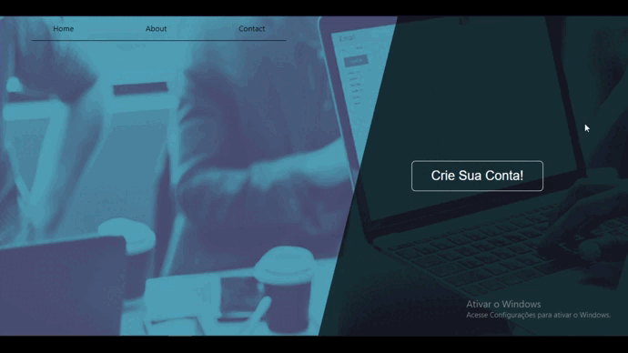

# Form using modal

## | About

This is a project where I used some new stuff that I've learned in ReactJS.

## | Overview

## | Mobile Version

## | Made Using
<ul>
    <li>ReactJS</li>
    <li>Typescript</li>
    <li>Styled-components</li>
    <li>React Hooks</li>
</ul>

## | How to Run

Make sure "Git" is installed in your PC!

    git clone https://github.com/Bruno-Messias-B-S/Form-Modal.git

### Install
- `npm install`

### To run
- `npm run dev`

## | Made By
[Bruno Messias](https://www.linkedin.com/in/bruno-messias-bs/)
